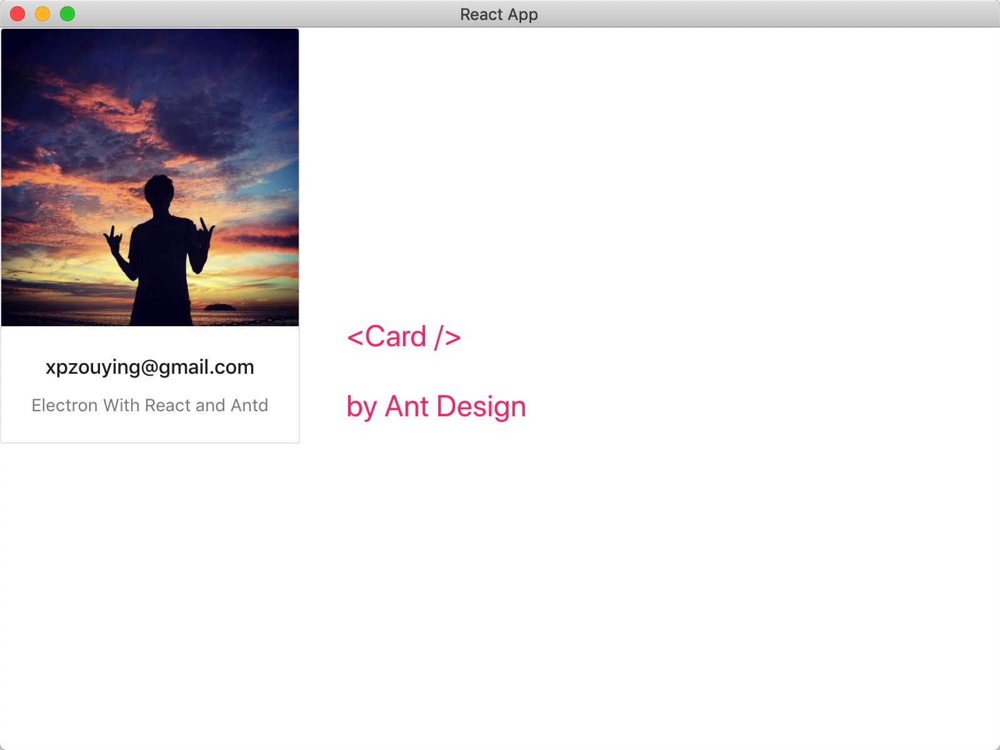

# electron-react-antd
The simplest demo: 

Electron integrate with react and antd(ant design)




### HowTo Use:


```bash
git clone https://github.com/xpzouying/electron-react-antd

cd electron-react-antd

npm install
```


**Dev**


1. make sure `DEV: true` in `package.json`
2. run react app: 
   1. `npm run start`
   2. open browser and go to `http://localhost:3000/`. Do not close it!!!
3. run electron app: `npm run estart` 


**Product**

1. make sure `DEV: false` in `package.json`
2. build the react app: `npm run build`
3. run electron app: `npm run estart`

